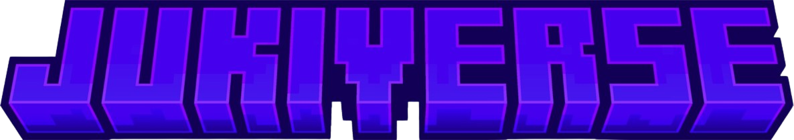

<p align="center">
  <a href="#" target="_blank">
    
  </a>
</p>

<p align="center">
  <a href="https://laravel.com"></a>
  <a href="https://getbootstrap.com"></a>
  <a href="#"></a>
  <a href="#"></a>
</p>

## 📌 Project Overview

**Jukiverse Web** is a specialized Minecraft top-up platform built with **PHP Laravel** and **Blade**. Instead of selling individual items, this system focuses on a **Credits-Based Economy**. Players can purchase virtual credits via **Midtrans**, which are then automatically injected into the server's economy or a database via the **Pterodactyl API**.

### Key Features:
- **Credit Top-Up System**: Clean workflow for purchasing virtual currency.
- **Minecraft-Linked Auth**: Custom `CheckMinecraftAuth` middleware ensures credits are sent to the correct player.
- **Automated Balance Injection**: Real-time console command execution to update player balance.
- **Bootstrap UI**: Professional and responsive shop interface.

---

## 🚀 Setup Tutorial

### 1. Install Dependencies
Clone the repository and install the necessary PHP and JavaScript packages:

```bash
# Install Laravel dependencies
composer install

# Install Frontend dependencies (Bootstrap, etc.)
npm install
npm run build
```

### 2. Environment Setup
Initialize your environment variables and generate a unique application key:
```bash
cp .env.example .env
php artisan key:generate
```

### 3. Configure API Keys
Open your .env file and provide the credentials for your external services:

## Midtrans Configuration
Get this from your midtrans Dashboard.
```bash
MIDTRANS_SERVER_KEY=SB-Mid-server-xxxxxxxxxxxx
MIDTRANS_CLIENT_KEY=SB-Mid-client-xxxxxxxxxxxx
MIDTRANS_IS_PRODUCTION=false
```
## Pterodactyl Configuration
Generate Client API Key di Pterodactyl Panel (Account Settings > API).
```bash
PTERO_BASE_URL=[https://panel.name.com](https://panel.name.com)
PTERO_API_KEY=ptla_xxxxxxxxxxxxxxxxxxxxxxxx
PTERO_SERVER_ID=xxxxxxxx-xxxx-xxxx-xxxx
```

### 4. Run Migrations & Seeding
Set up your database tables and populate initial products:
```bash
php artisan migrate
php artisan db:seed --class=ProductSeeder
```

### 🔄 Integration Logic (The Flow)
The system is architected for secure, automated credit top-ups:

## The Authentication Flow
- CheckMinecraftAuth Middleware: Validates that the user has a linked Minecraft session before allowing access to the Top-Up page.

## The Purchase Flow
1. Selection: The player selects a credit bundle handled by ProductController.
2. Checkout: PurchaseController generates a unique invoice and a Midtrans snap_token.
3. Payment: The player pays using their preferred method (QRIS, Virtual Account, or E-Wallet).

## The Automation Flow (Fulfillment)
1. Notification: Midtrans sends a secure Webhook (JSON) once the payment is successful.
2. Verification: The backend verifies the signature_key and transaction status server-side.
3. Execution: The system triggers a command to the Pterodactyl console to add credits:
   - Endpoint: /api/client/servers/{id}/command
   - Command: eco give {username} {amount} or points give {username} {amount}.

## 📂 Project Structure
- ```Controllers/ProductController.php```: Manages the display of credit packages and pricing.
- ```Controllers/PurchaseController.php```: Core logic for Midtrans transactions and Pterodactyl API calls.
- ```Middleware/CheckMinecraftAuth.php```: Validates the active Minecraft player session.
- ```Middleware/AdminMiddleware.php```: Protects the administrative dashboard for transaction monitoring.

## 🛡 Security
- Server-Side Fulfillment: Balance injection only occurs after server-to-server webhook validation from Midtrans.
- CSRF & Signature Validation: Prevents client-side data tampering and unauthorized transaction spoofing.

<p align="center"><b>Built by Julius Wuwung</b></p>
